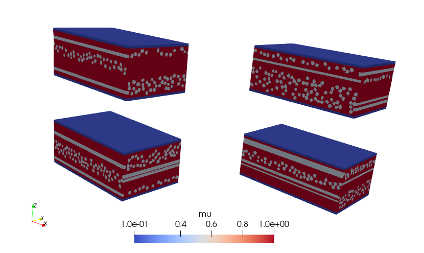

# Jax Materials
High performance implementation of linear elasticity solvers based on [CUDA](https://developer.nvidia.com/cuda) and [Jax](https://docs.jax.dev/en/latest/index.html#). These solvers are used in machine learning framework for predicting the effective linear elasticity tensor for materials containing layers of fibres.

## Contents
This repository contains the following code:

#### CUDA linear elasticity solver
A highly efficient [CUDA](https://developer.nvidia.com/cuda) accelerated solver of the linear elasticity equation in isotropic materials based on the Lippmann Schwinger method by [[Moulinec and Suquet, 1998. Computer Methods in Applied Mechanics and Engineering, 157(1-2), pp.69-94]](https://arxiv.org/abs/2012.08962).

#### Jax linear elasticity solver
A [Jax](https://docs.jax.dev/en/latest/index.html#) implementation of the same method, which allows back-propagation through the solver for use in a ML setting. In addition to the plain Lippmann Schwinger solver, the code also supports Anderson acceleration as described in [[Wicht, Schneider and Boehlke, T., 2021. International Journal for Numerical Methods in Engineering, 122(9), pp.2287-2311]](https://onlinelibrary.wiley.com/doi/pdfdirect/10.1002/nme.6622). Since any Jax code is inherently differentiable, the solver can be used as a building block in a machine learning framework (see below).

Both solvers use the same discretisation as the [AMITEX solver](https://amitexfftp.github.io/AMITEX/), which is described in [[Gelebart  2020. Comptes Rendus. Mecanique, 348(8-9), pp.693-704]](https://comptes-rendus.academie-sciences.fr/mecanique/item/CRMECA_2020__348_8-9_693_0/). For mathematical details see the [`./doc` subdirectory](./doc/).

#### Fibre distribution generator
Code for sampling the Lame parameters which can be used as an input to the solvers. The generated samples contain cross-ply layers of fibres as shown in the following figure:



#### ML toolchain
A ML toolchain which uses the above code to train machine learning models that predict the efficient elasticity tensor for a given pair of Lame-parameter fields.

## Installation

### Prerequisites 
The CUDA solver requires a working cuda installation, including the [NVidia CUDA Toolkit](https://developer.nvidia.com/cuda/toolkit) which contains the [NVidia CuFFT library](https://developer.nvidia.com/cuda/toolkit). A working C++ compiler and [CMake](https://google.github.io/googletest/) is required to compile and install the solver. To run the automated tests, the [GoogleTest](https://google.github.io/googletest/) is required.

See [`pyproject.toml`](pyproject.toml) for a list of required Python packages.

### Instructions
The following instructions should work on Linux machines, but will need to be adapted on Windows and Mac.

#### CUDA solver
1. Clone this repository
2. Change to the `cuda` subdirectory
3. Configure in the `build` directory with
```
cmake -B build -DCMAKE_INSTALL_PREFIX=<INSTALL_DIR>
```
where `<INSTALL_DIR>` is the directory where the solver library should be installed. If the `-DCMAKE_INSTALL_PREFIX=<INSTALL_DIR>` is omitted, the default (usually `/usr/lib/`) is used, and you will likely need root access to install the library in this location.

4. Build the solver with
```
cmake --build build
```
5. (Optionally), if the google test framework is installed, test the library by running
```
./build/bin/test
```
6. Install the library by running
```
cmake --install build
```
7. Add the install directory to `LD_LIBRARY_PATH` to ensure that it can be loaded from Python
```
export LD_LIBRARY_PATH=<INSTALL_DIR>:${LD_LIBRARY_PATH}
```
#### Python library
In the main directory of the repository run
```
python -m pip install .
```
Optionally, add `--editable` flag for an editable install.


